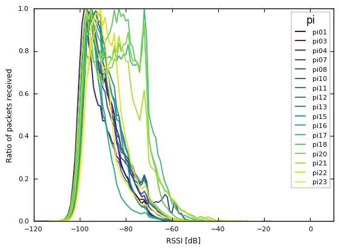

# ADE2016 Dataset analysis (automatic) report

## Dataset stats
- Estimotes/Sensortags Thursday: 811/60

- Estimotes/Sensortags Friday: 556/61

- Estimotes/Sensortags: 812/109

- Packets/Copies (> 100ms criteria) Thursday: 6896252/14720392

- Packets/Copies (> 100ms criteria) Friday: 7758473/10965277

- Packets/Copies (> 1s criteria) Thursday: 2483302/19133342

- Packets/Copies (> 1s criteria) Friday: 3002246/15721504

## Dataset description (after 16:00)

### Stats

**Total number of packets+copies/packets**

* Thursday: 15395356/5365372

* Friday: 14721130/6417852

**Packets/copies received per Pi**

* pi01: 237393/608476

* pi03: 703904/1056965

* pi04: 239727/970463

* pi07: 642466/1197326

* pi08: 786314/3115882

* pi10: 617024/3140477

* pi11: 1551013/3613372

* pi12: 631602/1757542

* pi13: 476912/1611053

* pi15: 1168945/3263126

* pi16: 222937/1025860

* pi17: 187957/474952

* pi18: 331955/852403

* pi20: 28636/498403

* pi21: 124420/509947

* pi22: 2912641/4588967

* pi23: 919378/1831272

**Packets/copies received per Pi (Estimotes and Sensortags only)**

* pi01: 83168/197428

* pi03: 240610/327774

* pi04: 158456/410119

* pi07: 427957/572370

* pi08: 707061/1704242

* pi10: 550958/1573507

* pi11: 1248066/2047018

* pi12: 293635/574916

* pi13: 234098/610378

* pi15: 914593/1653861

* pi16: 152186/457949

* pi17: 126418/229658

* pi18: 234610/488553

* pi20: 13238/244415

* pi21: 70234/249374

* pi22: 2229459/2799389

* pi23: 143884/374497

**Packets/copies received per type**

* 0x0000: 7455/21784

* 0x0001: 91/96

* 0x0003: 689/3166

* 0x0010: 206/292

* 0x004C: 3068421/12431261

* 0x0057: 70/147

* 0x0059: 6/10

* 0x006B: 227/435

* 0x0075: 138/281

* 0x0087: 15733/551100

* 0x00C4: 250382/392423

* 0x00D0: 5/9

* 0x00DF: 592/828

* 0x0110: 356/671

* 0x012D: 57219/61778

* 0x0157: 635/1027

* 0x0180: 670/1035

* 0x01C8: 8025/8026

* 0x0201: 4/6

* 0x0241: 8/16

* 0x02F2: 489/839

* 0x02F9: 48/85

* 0x0300: 80975/554698

* 0x0A0E: 5/7

* 0x2400: 0/6

* 0x3300: 1690/2709

* 0x3845: 1/2

* 0x4858: 2/4

* 0x4D32: 29/248

* 0x6D6F: 48/64

* 0x7500: 7942/17524

* 0x7800: 141/169

* 0x8700: 4345/23069

* 0xFF90: 9/19

* 0xFFF0: 109/114

* estimote-iBeacon: 1457752/1930792

* estimote-nearable: 4453025/5861168

* sensortag: 1917854/6723488

* unknown: 447828/1527090

**System/Noise packets**

* Thursday: 3435497/1929875

* Friday: 4393134/2024718

**Sensortag/Estimote packets**

* Thursday: 960093/2475404

* Friday: 957761/3435373

**Mean/Max packets per minute**

* Thursday: 11896.61/19179.00

* Friday: 13124.44/25292.00

**Mean/Max sensors per minute**

* Thursday: 393.67/692.00

* Friday: 435.55/569.00

#### Figure: Packets vs. packets + copies 

#### Figure: System (Estimote & Sensortag) packets vs. Noise packets 

#### Figure: System (Estimote & Sensortag) bytes vs. Noise bytes 

#### Figure: Estimote packets vs. Sensortag packets 

#### Figure: Estimote vs. Sensortag sensors seen per minute 

#### Figure: Estimote vs. Sensortag sensors seen per minute in the Overdrive room 

#### Figure: Packets received per PI, including copies 

#### Figure: Estimote and Sensortag packets received per PI, including copies 

#### Figure: Packets received per type, including copies 

## BLE Model statistics

#### Figure: Distribution of packets received vs. their RSSI 

#### Figure: Distribution of packets received per pi vs. their RSSI 

### Stats

RSSI value with more packets received: Int64Index([-95], dtype='int64', name=u'rssi')

## Time between packets of the same type

#### Figure: CDF of the time between consecutive packets received from the same sensor filtering deltas < 1s 

### Stats (delta < 1s)

**('Friday', 'estimote-nearable')**:

* 100% 89546.97
* 90% 10.43
* 75% 5.20
* 50% 2.60
* 25% 1.31

**('Friday', 'sensortag')**:

* 100% 78710.14
* 90% 4.02
* 75% 2.00
* 50% 1.01
* 25% 1.01

**('Thursday', 'estimote-nearable')**:

* 100% 12140.61
* 90% 12.99
* 75% 5.21
* 50% 2.60
* 25% 1.31

**('Thursday', 'sensortag')**:

* 100% 9749.60
* 90% 3.02
* 75% 2.01
* 50% 1.01
* 25% 1.01

## FoR clustering

#### Figure: Clustering of FoR paths by pi on Friday 

#### Figure: Heatmap of FoR paths by pi on Friday 

#### Figure: Clustering of FoR paths by pi on Thursday 

#### Figure: Heatmap of FoR paths by pi on Thursday 

#### Figure: Clustering of FoR paths by room on Friday 

#### Figure: Heatmap of FoR paths by room on Friday 

#### Figure: Clustering of FoR paths by room on Thursday 

#### Figure: Heatmap of FoR paths by room on Thursday 

